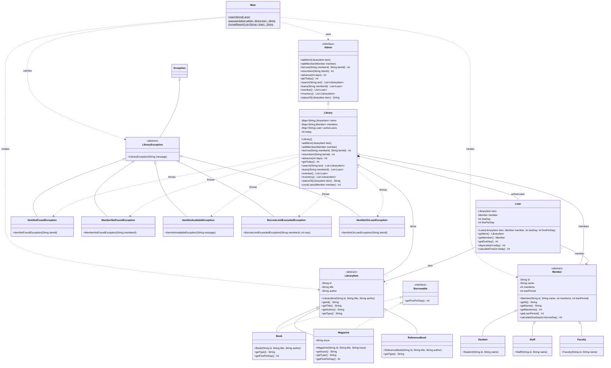

# UML - Diagram

```mermaid
classDiagram
    direction TB

    class Main {
        +main(String[] args)$
        -execute(Admin admin, String line)$ String
        -formatReport(List~String~ lines)$ String
    }

    Main ..> Admin : uses
    Main ..> LibraryItem : creates
    Main ..> Member : creates
    Main ..> LibraryException : catches

    class Admin {
        <<interface>>
        +addItem(LibraryItem item)
        +addMember(Member member)
        +borrow(String memberId, String itemId) int
        +returnItem(String itemId) int
        +advance(int days) int
        +getToday() int
        +search(String text) List~LibraryItem~
        +loans(String memberId) List~Loan~
        +overdue() List~Loan~
        +inventory() List~LibraryItem~
        +statusOf(LibraryItem item) String
    }

    class Library {
        -Map~String,LibraryItem~ items
        -Map~String,Member~ members
        -Map~String,Loan~ activeLoans
        -int today
        +Library()
        +addItem(LibraryItem item)
        +addMember(Member member)
        +borrow(String memberId, String itemId) int
        +returnItem(String itemId) int
        +advance(int days) int
        +getToday() int
        +search(String text) List~LibraryItem~
        +loans(String memberId) List~Loan~
        +overdue() List~Loan~
        +inventory() List~LibraryItem~
        +statusOf(LibraryItem item) String
        -countLoans(Member member) int
    }

    Admin <|.. Library
    Library "1" o-- "*" LibraryItem : items
    Library "1" o-- "*" Member : members
    Library "1" *-- "*" Loan : activeLoans

    class Loan {
        -LibraryItem item
        -Member member
        -int dueDay
        -int finePerDay
        +Loan(LibraryItem item, Member member, int dueDay, int finePerDay)
        +getItem() LibraryItem
        +getMember() Member
        +getDueDay() int
        +daysLate(int today) int
        +calculateFine(int today) int
    }

    Loan "*" --> "1" LibraryItem : item
    Loan "*" --> "1" Member : member

    class LibraryItem {
        <<abstract>>
        -String id
        -String title
        -String author
        +LibraryItem(String id, String title, String author)
        +getId() String
        +getTitle() String
        +getAuthor() String
        +getType()* String
    }

    class Borrowable {
        <<interface>>
        +getFinePerDay() int
    }

    class Book {
        +Book(String id, String title, String author)
        +getType() String
        +getFinePerDay() int
    }

    class Magazine {
        -String issue
        +Magazine(String id, String title, String issue)
        +getIssue() String
        +getType() String
        +getFinePerDay() int
    }

    class ReferenceBook {
        +ReferenceBook(String id, String title, String author)
        +getType() String
    }

    LibraryItem <|-- Book
    LibraryItem <|-- Magazine
    LibraryItem <|-- ReferenceBook
    Borrowable <|.. Book
    Borrowable <|.. Magazine

    class Member {
        <<abstract>>
        -String id
        -String name
        -int maxItems
        -int loanPeriod
        +Member(String id, String name, int maxItems, int loanPeriod)
        +getId() String
        +getName() String
        +getMaxItems() int
        +getLoanPeriod() int
        +calculateDueDay(int borrowDay) int
    }

    class Student {
        +Student(String id, String name)
    }

    class Staff {
        +Staff(String id, String name)
    }

    class Faculty {
        +Faculty(String id, String name)
    }

    Member <|-- Student
    Member <|-- Staff
    Member <|-- Faculty

    class LibraryException {
        <<abstract>>
        +LibraryException(String message)
    }

    class ItemNotFoundException {
        +ItemNotFoundException(String itemId)
    }

    class MemberNotFoundException {
        +MemberNotFoundException(String memberId)
    }

    class ItemNotAvailableException {
        +ItemNotAvailableException(String message)
    }

    class BorrowLimitExceededException {
        +BorrowLimitExceededException(String memberId, int max)
    }

    class ItemNotOnLoanException {
        +ItemNotOnLoanException(String itemId)
    }

    Exception <|-- LibraryException
    LibraryException <|-- ItemNotFoundException
    LibraryException <|-- MemberNotFoundException
    LibraryException <|-- ItemNotAvailableException
    LibraryException <|-- BorrowLimitExceededException
    LibraryException <|-- ItemNotOnLoanException

    Library ..> ItemNotFoundException : throws
    Library ..> MemberNotFoundException : throws
    Library ..> ItemNotAvailableException : throws
    Library ..> BorrowLimitExceededException : throws
    Library ..> ItemNotOnLoanException : throws
```
